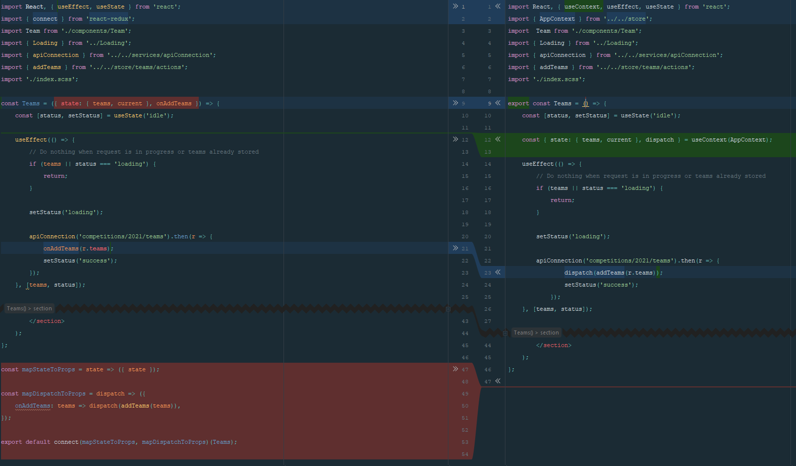

**Since I started my adventure with React many things changed. I'm in love with all the new features around development, but sometimes I think it's growing to fast anyway, and it's really hard to track all interesting things at once. Nowadays React introduced great hooks you probably already heard about, and if so you know they provide totally great functionality. If you worked with global state management in React you used Redux or MobX (or some other less common) package for sure. While we have latest useContext and useReduced hooks from React we can forget about external libraries and I would like to show you how. \
We will start with build some really basic application with three-four components connected by Redux (based on data from some public free API) and then we are going to switch this connection from Redux to newest native React functionality.\
As a second additional article I would like to show you how you can assure your code work properly and avoid many issues thanks to using TypeScript for this application. So I will go a bit deeper into properly constructed data flow through those `context`, `useReducer` and all components**

For our purpose we are going to use **Create React App (CRA)** environment as it’s most reliable and ease for such use cases.
If you are not familiar with **CRA** yet, I would suggest you to make a quick read on their [documentation](https://github.com/pandao/editor.md "documentation"),  but actually it all comes to three simple commands : 

```javascript
npx create-react-app my-app
cd my-app
npm start
```

...and that’s it, magic happened, you can start coding your **React** project.

Actually we would like to make one more thing which is installing `node-sass` library. Thanks to it we can import our `*scss` files directly into components. I'm not going to describe you how they are styled as this is not our point of interests but for better UI & UX in our work they will be included in final solution.

## Structure

Let’s begin with write some basic fundamentals for our work, and let’s say we want to make a list with all English Premier League football teams, and second list somewhere nearby where we will display latest fixtures of clicked team. 
It will be really simple application with just two areas. 

After CRA install lets create following structure in `src` folder:

```bash
├── src
│   ├── components
│   │   ├── Teams
│   │   │   ├── components
│   │   │   │   ├── Team
│   │   │   │   │   └── index.js
│   │   │   └── index.js
│   │   ├── Statistics
│   │   │   └── index.js
```


I strongly believe the code is self explained. Some variables and objects you may noticed are not described. We will discus them later as well when we connect our store. For now to avoid confusions you can imagine they are just passed props to our components. Every step of our articles will have a [codesandbox.io](https://codesandbox.io "codesandbox.io") entire code included so you can always reference to working example over there :)

Our Teams component will just display title and loop of single Team components.

```javascript
<section className="Teams app-panel">
    <h2>Teams</h2>

    {teams && (
        <div className="Team__list">
            {teams.map(team => (
                <Team key={team.id} team={team}/>
            ))}
        </div>
    )}

</section>
```
    
Single Team component is a combination of icon (small logo of the team) and button which will trigger some action. But don't worry about it for now as well.
    
```javascript
<p className="Team">
    

    <button
        type="button"
        className={`Team-link${current === team.id ? ' active' : ''}`}
        name={team.shortName}
        onClick={() => onTeamSelect(team.id)}
    >
    {team.name}
    </button>
</p>
```
    
Our Statistic component will also display a title and our loop of team fixtures as well as small information for initial state when no team is selected yet.

```javascript
<section className="Statistics app-panel">
    <h2>Statistics</h2>
    
    {teams && (
        !current
            ? <p><i>Please select team to display information</i></p>
            : <table className="Statistics__list">
                <tbody>
                {currentTeam.stats.map(match => (
                    <tr key={match.id}>
                        <td>({match.competition.name})</td>
                        <td>{match.homeTeam.name} {match.score.fullTime.homeTeam} - {match.score.fullTime.awayTeam} {match.awayTeam.name}</td>
                    </tr>
                ))}
                </tbody>
            </table>
     )}
</section>
```
     
And in the end we can go to our main `App.js` file provided by **CRA** and render our components.
    
```javascript
<main className="PremierLeague">
    <Teams />
    <Statistics />
</main>
```
    

## Props Drilling

Those two areas has to be connected and share their states, so we are facing a situation where local component state is not enough. 
> Of course we can always pass our props through components tree, but it is really important to remember whenever your application starts to grow, will make keep all things clean much harder. 

You can find that solution under **props drilling** name. Example below illustrates the situation for our (quite flat) structure: 


To cover above problems developers used to use **Redux** the most. **Redux** with its **Provider** came here for a rescue. As you are reading this article I believe you know what **Redux** can do for you, but to be clear it’s a global state container which can keep all your app information and then thanks to **Provider** from `react-redux` library extension (which use standard `React Context API`) pass them to whichever component needs. So now we have desired functionality :


## Redux

#### Redux is still in expansion

I would like to focus on latest build in **React** hooks. They can make pretty same thing without any external libraries needed. I’m not going into **Redux** any deeper than required for our example, but if you still have some doubts about **Redux** take a look at their [documentation](https://redux.js.org/introduction/getting-started "documentation"). It is still powerful and consistently updated library with many great features and even latest (middle of 2019) own hooks like **useDispatch** and **useStore** whose only takes advantage on functionality you need. We are going to use most common method for developers and we are going to use HOC `connect` to make our components 'talk' with store.

#### But it is React itself forces Redux to do so ;)

Since **React** is still moving with the times, nowadays we have a really useful built in hooks. So let me introduce you a great and powerful cooperation of **useReducer** with **useContext**. To make it smoother to understand and see real differences we are going to start with create a global stating based on **Redux** and then we move it to newest functionality form **React**.

#### Let's have some Redux(ing)
For the beginning let's build our store. We want to keep our teams array in global state, as well as current team ID for reference, whenever user selects one of our teams.

Extend our folders structure like so: 
```bash
├── src
│   ├── components
│   ├── store
│   │   ├── teams
│   │   │   ├── actions.js
│   │   │   └── reducers.js
│   │   ├── current
│   │   │   ├── actions.js
│   │   │   └── reducers.js
│   │   └── index.js
```

Starting with teams let write some basic actions:

```javascript
export const ADD_TEAM_STATS = 'ADD_TEAM_STATS';
export const ADD_TEAMS = 'ADD_TEAMS';

export const addTeamStats = (stats, id) => ({
    type: ADD_TEAM_STATS,
    stats,
    id,
});

export const addTeams = teams => ({
    type: ADD_TEAMS,
    teams,
});
```
    
As typical we write our `action` names as a constants and based on that names we are building object used by `reducers` below whenever one of this `action` is `dispatched`:

```javascript
import { ADD_TEAM_STATS, ADD_TEAMS } from './actions';

export const teamsReducer = (state = null, action) => {
    switch (action.type) {
    case ADD_TEAMS:
        return state ? [...state, ...action.teams] : action.teams;

    case ADD_TEAM_STATS:
        const newState = [...state];
        let found = newState.find(team => team.id === action.id);
        if (found) {
            found['stats'] = action.stats;
        }
        return newState;

    default:
        return state;
    }
};
```

Here we are checking which `action` was `dispatched` and return new modified state to consume by our components we connect to it. Thing to note here is I do not extend store for another `stats` space. I decided it would be easier and more reliable to keep teams data inside already pulled team object from API. Its a more clean way for me, but if you like and think is better to separate those, feel free to make another `stats` array with stats objects extended of team id to easy find them. Having them saved in global store avoid making another call whenever user will click for a second time on the same Team. This will render current saved values in real time. Test it yourself on one of my codesanbox provided how fast will display data when you switch teams and then go back to previous one. This caching data feature for me is what global states all about. 
 
 Then we can fill our `actions` and `reducers` for current team state accordingly: 
 
`actions.js`
 
```javascript
 export const SET_CURRENT_TEAM = 'SET_CURRENT_TEAM';
 
 export const setCurrentTeam = teamId => ({
     type: SET_CURRENT_TEAM,
     teamId,
 });
```
     
`reducers.js`

```javascript
import { SET_CURRENT_TEAM } from './actions';

export const current = (state = null, action) => {
    switch (action.type) {
    case SET_CURRENT_TEAM:
        return action.teamId;

    default:
        return state;
    }
};
```

Finally we have to combine them all together and send to our application. In our store `index.js` file put this code : 

```javascript
import React from 'react';
import { createStore, combineReducers } from 'redux';
import { Provider } from 'react-redux';
import { currentReducer } from './current/reducres';
import { teamsReducer } from './teams/reducres';

export const AppStore = ({ children }) => {
    const store = createStore(
        combineReducers({
            teams: teamsReducer,
            current: currentReducer,
        }),
    );

    return (
        <Provider store={store}>
            {children}
        </Provider>
    );
};
```

So we have really basic store example here. After importing our reducers we have to combine them thanks to `combineReducers()` function which takes an object of all our reducers. 

The rest is a plain **Redux** `createStore` function. Returned state from that function we will pass down the tree by our mentioned earlier **Provider** to every rendered `children` which are passed to our store component.

So, I hope it is clear, that to make it all connected we have to put our application as a children of Provider so let's extend our `App.js` file to return:
    
```javascript
<AppStore>
    <main className="PremierLeague">
        <Teams />
        <Statistics />
    </main>
</AppStore>
```
     
`AppStore` is how we called our store component and everything inside suppose to be possible to connect. We won't know without try, so lets do it. 
Starting as always from teams list we need to export it by HOC mentioned above `connect` :

```javascript
const mapStateToProps = state => ({ state });

const mapDispatchToProps = dispatch => ({
    onAddTeams: teams => dispatch(addTeams(teams)),
});

export default connect(mapStateToProps, mapDispatchToProps)(Teams);
```

So as you may noticed we getting whole state here and map it to props, where we can destruct our values...

```javascript
const Teams = ({ state: { teams }, onAddTeams }) => {}
```

... and we also handling prop `onAddTeams` which is function for dispatch our `addTeams` action.

With those values now our **Teams** component finally looks like working one because it has a properties required to render teams.

The same operation will connect our single Team component to handle click function and fire proper `action` as well as Statistics component to display all fixtures whenever they appear in store:

`Team`

```javascript
const Team = ({ team, state: {current}, onTeamSelect }) => {

[...]


const mapStateToProps = state => ({ state });

const mapDispatchToProps = dispatch => ({
    onTeamSelect: teamId => dispatch(setCurrentTeam(teamId)),
});

export default connect(mapStateToProps, mapDispatchToProps)(Team);
```

`Statistics`

```javascript
const Statistics = ({ state: { teams, current }, onAddTeamStats }) => {

[...]

const mapStateToProps = state => ({ state });

const mapDispatchToProps = dispatch => ({
    onAddTeamStats: (stats, id) => dispatch(addTeamStats(stats, id)),
});

export default connect(mapStateToProps, mapDispatchToProps)(Statistics);
```
 
 From this point all our components are connected to store and can talk with it. All we have to do now is to provide some data to render.

## Api Connection
There is many libraries out there (like axios etc.) which may help you build the best request, but I used plain JS `fetch` as it's totally enough for our purpose.
To keep all things clear and consistent create a new folder in your project `src` in place of helpers functionality:

```bash
├── src
│   ├── services
│   │   ├── apiConnection
│   │   │   └── reducers.js
```

I decided to use free football api provided by [football-data.org](https://www.football-data.org/documentation/api "football-data.org"). They require authentication by `X-Auth-Token` header. You can receive your own token by email after fill some form information (such quick register). 

```javascript
export const apiConnection = async (endpoint = '') => {
    return await fetch(`https://api.football-data.org/v2/${endpoint}`, {
        method: 'GET',
        headers: {
            'X-Auth-Token': process.env.REACT_APP_API_KEY,
        },
    })
        .then(r => {
            if (!r.ok) {
                throw Error(`${r.statusText}`);
            }
            return r.json();
        })
        .catch(error => {
            throw Error(`${error}`);
        });
};
```

So we've build base helper to handle api connection and we passed only one param as an endpoint for which will be different for every component.

`API_KEY` is stored as an environment variable. In codesandbox.io is hidden from visitors, but if you would like to clone the repository and try it yourself, you'll need to rename `.env.example` file to `.env` and switch inside value to your own.  
 
> You may also want to extend your UX for some errors displaying etc. to improve your users experience but for our simple example we will just `throw Error` to somehow communicate about problems with frontend.

#### Connect components to API and store it's values in Redux
Now we can use this connection to get our teams data from API in a **Teams** component `useEffect`:

```javascript
useEffect(() => {
    if (!teams) {
        return;
    }

    apiConnection('competitions/2021/teams').then(r => {
        onAddTeams(r.teams);
    })
}, [teams]);
```
    
Please note we have `teams` as a dependency to refresh our effect whenever they changed. First thing is to return the effect when teams appeared to not make another unnecessary api request.
It would be also a good practice to prevent further requests whenever our component is already waiting for response, so we can use basic state hook and stops effect when we faced a desired status:

```javascript
const [status, setStatus] = useState('idle');

useEffect(() => {
    // Do nothing when request is in progress or teams already stored
    if (teams || status === 'loading') {
        return;
    }

    setStatus('loading');

    apiConnection('competitions/2021/teams').then(r => {
        onAddTeams(r.teams);
        setStatus('success');
    });

}, [teams, status]);
```

So when our component is in `loading` state it will also return because we know that calling api is in progress. Whenever it respond with success we can change a status of our app and our effect will not fire anymore as the teams just appeared, so another conditional is returning it. Just do not forget to update your effect dependencies on this `status` to avoid any issues with state refreshing.

Please just have in mind that simple solution works good for small projects like ours. When you plan to write something more complex with many places depended on this API request, then I would suggest to write additional `action` and `reducer` to keep state of this part as separated place in global store. Thanks to this, every component waiting for that data can display loaders, errors or anything for user information that something is currently processing.
  
Second component which will also connect to our API and handle data is **Statistics**. To display current team information we will save a `current` value in our store. To get it we check if there is a team object stored with same ID value as our `current`. Then if we find it, we need to check if that object has a `stats`. If no, we have to call API for that information and store them in this team object to later use : 

```javascript
const [status, setStatus] = useState('idle');
const [currentTeam, setCurrentTeam] = useState(null);

useEffect(() => {
    // Try to find team provided by current prop from redux store
    const found = teams && current &&
        teams.find(team => team.id === current);
    
    // If the team at given id was found in store and it's different than 
    // existing we have stored already then we want to update state of it.
    if (found && found !== currentTeam) {
        setCurrentTeam(found);
    }
}, [current, currentTeam, teams]);

useEffect(() => {
    // Do nothing when :
    // - 'current' value is not provided 
    // - request is in progress.
    // - or current team was found and has stats already so we can load them from our memory (store).
    if (!current || status === 'loading' || (currentTeam && 'stats' in currentTeam)) {
        return;
    }

    setStatus('loading');

    // Handle Api connection to retrieve latest matches for selected team
    apiConnection(`teams/${current}/matches?status=FINISHED`)
        .then(r => {
            onAddTeamStats(r.matches, current);
            setStatus('idle');
        });
}, [current, currentTeam, status, teams]);
```

> One thing may be interested to note here as I used a newest ES `'stats' in currentTeam` construction to check if `stats` key exists in team object. It's still equivalent to ways like `Object.keys().includes()` or or any others.

Here is a good place where we should stop for a while and think about user experience. As you are able to "render in mind" tree code you can notice that we only inform our app about it's state, and user still doesn't know if there is something happening in background. So lets implement some basic loader and use it for our components:

```bash
├── src
│   ├── components
│   │   ├── Loading
│   │   │   └── index.js
```

Put there whatever loader you like. You can copy one from our example, just go to codesandbox.io to find it ;)

Then we can use it in our Teams and Statistics like eg: 

`Statistics`

```javascript
<section className="Statistics app-panel">
    <h2>Statistics</h2>

    {teams.length === 0 &&
    <Loading message={'Waiting for teams load'} />}

    {status === 'loading' &&
    <Loading message={`Downloading ${currentTeam.name} data`} />}

    [...Fixtures table]
 </section>
```

Note that we have two loaders here. First one appears when component is waiting for teams data (required for another Teams component, and here is a situation which I mentioned to you before that whenever it grows it's good to keep that connection state with the data itself to use in many places).
Then we have second one appeared when our component effect is connecting to API and set status to `loading`. At the end we display simple information to make user know what to do (but only at initial state), and when stats are finally loaded there are looped below. 

So far I presented only functional code point of view, because additional styles and other code would make our article too big. All that code styled a bit for better UX you can find below on codesandbox:

```
//TODO : CODESANDBOX LINK FOR REDUX
```

# useReducer + useContext

Our plan is to switch functionality for global state from external Redux library to built in React hooks without any components rendered content interruption.
We will try to keep consistent as many variables names and namespaces as possible. We can left our actions and reducers untouched, as they are new useReducer functionality, and we actually mimic those one from Redux.

So our main issue here is to write new store based on that hook.
For our `index.js` file from `store` folder (`AppStore` component) let's provide some small modifications: 

```javascript
export const AppContext = React.createContext({});

export const AppStore= ({ children }) => {
    const [state, dispatch] = useReducer(combineReducers({
        teams: teamsReducer,
        current: currentReducer,
    }), {});

    return (
        <AppContext.Provider value={{ state, dispatch }}>
            {children}
        </AppContext.Provider>
    );
};
```
    
First of all we removed Redux Provider and used plain React Context (1st line). Then we replaced `createStore` function with **useReducer** hook.
This reducers returns array with two values, our state and dispatch function to fire an actions on state. Dispatch should looks familiar to you, as we used it as a parameter for `mapDispatchToProps` function via `connect` HOC from Redux.
In this situation we need to pass this dispatch function along with store state through context value.

If you observed closely you noticed also that we still didn't removed `combineReducers` function, and this function was used from Redux library, so what is going on here ?
The reducer's combining is quite simple and based on retrieving states from every entry to allocate them by given key. We can do slightly the same as Redux does in our another helper function.
Let's create `combineReducres` folder with `index.js` file inside of `services` folder with a following function: 

```javascript
export const combineReducers = (reducerDict) =>
    (state, action) => Object.keys(reducerDict)
        .reduce((acc, curr) => ({
            ...acc, [curr]: reducerDict[curr](state[curr], action),
        }), state);
```

You can find many different implementation of that functionality across the internet, and they all based on original Redux combining and try to mimic that as close as possible. I used and modified for better ES6 some of existing ones as well (from [thchia](https://gist.github.com/thchia/dd1bc8200fd8cff89cfa6c928983e5c4 "thchia")).
This will make our state looks combined exactly the same way as it comes from Redux.
As you can see there are minor changes for store building and only one small helper function.

Our store is now ready and we can switch our components connection to it. Starting with Teams component we need to clean it from redux functionality, so remove `mapStateToProps`, `mapDispatchToProps` and their `connect` to component, then revert it to plain export as usual without any props passing to it:

```javascript
export const Teams = () => {...}
```
 
 Instead of taking data from props (populated by redux before), we are going to pull them from context where we stored it in last step.

```javascript
const { state: {teams, current}, dispatch } = useContext(AppContext);
```

Lastly we need to switch dispatching functionality. As we don't map it via custom namespace to our component props we can use dispatch function directly in our promise response, so all we need is to change `onAddTeams(r.teams);` to `dispatch(addTeams(response.teams));`.

I know you may be surprised but actually it's all we have to do, to make our component work. Take a look at whole diff of those files to realise there are really small adjustments:



The same adjustments we need to provide for Statistics component, so:
1) Remove `connect` functionality;
2) Switch data from props handling to useContext hook and connect it to AppStore context;
3) Change action dispatching to strict using dispatch function;

That's it. We change around 15 lines of code and same we removed. So we ended up with less and more readable code, without any external libraries needed and having exactly the same functionality.

All provided changes you can test yourself on accordingly created codesandbox.io environment:

``` //TODO : CODESANDBOX LINK FOR HOOKS```

## BONUS: Profiling our app

As a comparision of performance for both **Redux** and **Hooks** solutions I would like to show you a React Profiler API. It was introduced in React 16.9 for the first time. It provides us a **Profiler** component which helps to measure component timing for every single render. It takes two required props which are `id` (name of your profiler, as you can have many of them), and `onRender` which is callback for component updates. It receives several parameters which you can check in [React documentation](https://pl.reactjs.org/docs/profiler.html "React documentation"). We are interested in two of them which are `actualDuration` (showing us _"Time spent rendering the `Profiler` and its descendants for the current update."_) and `phase` (which return _"mount" | "update"_), while we want to read only values when app is rendered first time.
To implement Profiler for our AppStore you should change for both projects `App.js` file like below: 

```javascript
 export const App = () => {
     const callback = (id, state, actual) => state === 'mount' &&
         console.log(`Render time: ${actual}`);
 
     return (
         <Profiler id={'App'} onRender={callback}>
             <AppStore>
                 <main className="PremierLeague">
                     <Teams />
                     <Statistics />
                 </main>
             </AppStore>
         </Profiler>
     );
 };
```

After that, you are able to read time of your app required for first render. Let's go to browser, open devtools at console tab, refresh several times and (eye)catch average values. You can easily notice that our Hooks implementation is always faster, sometimes even twice. I left those Profilers in my code at codesandbox.io, so you can test it on your own and take a look at console results.
  
It is anyway hard to investigate what causes those rendering time's differences. Profiler component for React is great feature for measuring smaller parts of application or even single components to identify parts that may bring benefits from optimizations like memoization etc. But if you like to catch all components at once or even better, in a tree view, then you have to use browsers built in DevTools Profiler for React. For some browsers it's available as an extension.
  
Thanks to that profiler you can measure timings for even specific actions. Just start recording profile in point you want to check performance, and stop it whenever your use case ended. In my example I just stopped recording when components appeared on my screen (no need to wait for that as it will be second measurement as components updates and we are interested only about firs render time). After getting results aim the longest rendering components and try to use useMemo for memoization their functionality or whenever possible use lazy() for dynamic importing.
 
 I made 5 test for our Redux app as well as for our Hooks app. You can see the results below :
   

   
 You can see whole app tree rendered here. From the top we can notice :
 1) App
 2) Profiler (which is not intended to be in production mode)
 3) AppStore
 4) Provider
 5) ReactRedux.Provider
 6) ConnectFunction  (for both Teams and Statistics)
 7) ReactRedux.Provider (for both Teams and Statistics) (which is consumer I believe)
 8) Finally our two components Teams and Statistics
 
For 5 tries I recorded following render times : 9.4, 8.9, 8.7, 8.4, 8.1 which gives us around 8.7 as an average.
 
Now lets do the same for Hooks implementations: 


  
We can see that the structure of project is more flatten, and functionality is much less distributed. It's hidden under hooks rather tha exposed as standalone components (or High Order Components). It looks much more readable and has less steps, as we compare to redux tree it will looks like :

1) App
2) Profiler
3) AppStore
4) Context.Provider
5) Finally our two components Teams and Statistics

For 5 tries I recorded following render times : 5.8, 6.1, 6, 6.4, 6.3 which gives us around 6.1 as an average.
 
The difference is huge (around 30%). Not only in cleaner code and way better structure, but using built-in React functionality we are able to save tons of times. Our data amount is small, but you can imagine it in large, complex application as we cannot forget we are profiling just two empty areas.

Next you can try to play with measurement by yourself. Try to make own calculating based on React Profiler API with some of your components, or for overall and bigger purposes with great visualising effect use Profiler from your DevTools. You can try test reducers and their impact on rendering time to have better insight about the real differences in work. Both ready projects you can find on codesanbox.io with links above (or you can clone github repo linked from codesandbox). Do your own test, take your own conclusions, and let me know what you think.

As an conclusion you may take a look one more time how little is needed to switch between Redux and useReducer, as their actions and reducers stays the same and store object build with components connection to it requires actually several really easy and quick modifications, giving you less, cleaner, faster and better code ;)  

### HOLD ON! We haven't finished yet.
As I promised, while we have our application ready, we can lunch TypeScript support and check the places where we can improve our code and make it safe from possible issues. Our current code is working as expected, but actually it is still sensitive to some problems. Let's say for example we didn't provided `process.env.REACT_APP_API_KEY` variable and we are just using it directly. You can imagine what may happens when it's missing. To see how we can prevent those situations take a look at our [continuous article](https://www.chop-chop.org/article-1 "continuous article") and read more.

```//TODO : Add proper article URL```
