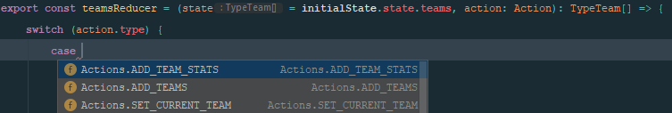

**Based on our [Premier League fixtures application](https://URL "Premier League fixtures application") from previous article, we are going to provide type checks for our functionality with TypeScript. TS is an open-source programming language from Microsoft. It help us prevent possible code issues whenever we do not provide or provide wrong, unexpected data to our components or functionality. In simple words it gives you the ability to add static types to your Javascript code. \
This post will show you how to include TypeScript in already started project, but i always recommend to start it along with project ast it provides many great features while development** 

In previous examples from plain redux or hooks we can meet many appearances of non properly checked data before it is rendered. You can still trace those issues if you have good and configured IDE which may prompt you about possible bug, but anyway we are allowed to render eg image like that :

```javascript
    process.env.REACT_APP_API_KEY
```

You probably noticed already what i mean. We are not sure about `REACT_APP_API_KEY` property existing in env variables, so we can face an error from JS and broken app while this is somehow missing. We have to define for our code if this is required value and we can safely expect it anytime, or is it optional so what to do in case of absent.

In order to get started you have to install `typescript` package along with types supporting packages for some other external libraries like eg `@types/react` to use with React... Or, you can use CRA as before. As you remember the first commend to install Create React App here we are going to do the same, but with one additional parameter: 

```
npx create-react-app my-app --template typescript
```

This will cover and manage for you all required base TypeScript functionality and configuration which you can always modify for own purposes via `tsconfig.json` file.\
Now you can start writing your app, but in our case we would like to copy `src` folder from last hooks implementation. You can chose your own way and for better experience start writing it from scratch.

If you have your app already build on **PropTypes** you would set those properties as required or make them default valued, and that can keep you informed in devtools if you "doing a good job". Using PropTypes you may be interested in infer your types using `InferProps` from `@types/prop-types` package. 

We will provide types to our entire app using only TypeScript. The main difference between Typescript and PropTypes is about Typescript validates types at compile time, but PropTypes are checked at runtime. So Typescript are a bit more than just forcing types on component props, but wherever (states, events, plain variables) we want to our JavaScript represent specific type/types structure. It will avoid us to build a project if any possible issue occurs.

Typescript has also great feature hidden under CTRL + SPACE shortcut to really useful code completion based on our types. So lets imagine we created types for `team` object we want to receive and then after calling `team.` we can use our shortcut for all possible values we expected: 


 
TypeScript is always recommended to be written simultaneously with code to have better control over your application, so always consider using TS when you starting project as it may be difficult sometimes to switch current code and you may face some code restructuring needed. The biggest challenge is to aim proper place to include your types or interfaces. As you switch your files to `.ts` extension and place in TS supported environment you will face many errors to resolve, and trying to provide types to specific files it sometimes turns out that your types should be somewhere upper in project structure to avoid redundant same types in different places. Because of that is always good to start from to highest to lowest component in your hierarchy.

So in our case the best would be to start from our store, as it is wrapping whole app providing some data to it.

Let's switch all our `*.js` files into `.tsx` or `.ts` files. It depends on file while `.tsx` format is used to parse `JSX` content type so it's mostly used with React apps, but whenever you have a plain JS functionality like our services we should use `.ts` extension. 
Then lets go to our index file of `store` folder and make following changes :

```javascript
type TypeAppContext {
    state: TypeState,
    dispatch: (e: Action) => void,
}

export const AppContext = React.createContext<Partial<TypeAppContext>>({});
```

In place of creating context to store our global state values we can define expected appearance of those data and we called it `TypeAppContext`. 

Please also note use of `Partial<>` element of TypeScript. This allow us to use empty initial value when the app is rendered for the first time and we didn't provided any data to context yet. But in that case you will have to use conditional for every context value used around app, so we can try to set some default ones to be sure it can always be consumed by components.
To handle that lets remove `Partial` and add some initial state(don't forget to use proper type so you will be fully supported with code completion wherever you want to use `initialState` object) :

```javascript
export const initialState: TypeAppContext = {
    state: {
        teams: [],
        current: 0
    },
    dispatch: () => alert('Context "dispatch()" function has not been loaded yet, please try again later.')
};

export const AppContext = React.createContext<TypeAppContext>(initialState);
```

We left `state` elements empty as we need initial empty value to display loadings, errors etc. and we also want to export this value to use in reducers initial states later. But for dispatch function without any initial default value, you will be forced to trigger it conditionally as we mentioned TypeScript is compile time checking functionality, so while it is undefined at first render it will stopping us to do so unless we use some conditional. To better visualise this case take a look at below examples:

```javascript
dispatch(setCurrentTeam(team.id))
```

This will make TS yelling about `dispatch` usage, so we have to make sure we trigger it only when available: 
    
```javascript
dispatch?.(setCurrentTeam(team.id))

dispatch && dispatch(setCurrentTeam(team.id))

if (!!dispatch)
     dispatch(setCurrentTeam(team.id))      
```

Or whichever method you prefer. So providing initial value like above we can omit that conditions and in case of any problems display some basic alert to our user that something was wrong, but nothing lost yet and he can retry ;)

We know we are passing two values to make our component able to communicate and contribute with our store. Those values are `state` with data, and `dispatch` function to fire assigned actions. Dispatch as you may noticed is defined as a function returning nothing but taking an `Action` type as a parameter. This parameter is an object of action type and some payload depends on which one we are dispatching. So for now lets create a type which can be one of our actions types, but we will left them to talk about later:

```javascript
export type Action = TypeActionAddTeams | TypeActionAddStats | TypeActionSetCurrent;
```

...and add second context param type as follows: 

```javascript
type TypeState = {
    teams: TypeTeam[],
    current: number
} 
```

As you remember in store state we are collecting two values as above, so we need also types for them. Current will be just a number corresponding to chosen team ID, and teams suppose to be an array of received teams from API. We can type them to looks like ... 

```javascript
export type TypeTeam {
    id: number,
    name: string,
    crestUrl: string,
    shortName: string,
    stats?: TypeStat[]
}
```

... and can use some tricky tip to handle them. To remind you we are using [football-data.org](https://www.football-data.org/documentation/api "football-data.org"), but whatever service you use, you can take a look at API structure at their API and get values you need to render components. There are also great online converters for TypeScript so you can make a test request to your API endpoint, copy all JSON responded and paste it to one of them, eg : [https://app.quicktype.io](https://app.quicktype.io/?l=ts "https://app.quicktype.io/?l=ts"). Then you can take retrieved Types into your code and adjust if needed.

In TypeTeam there is one custom and optional key called `stats`. This is where we are collecting statistics for current team after it was clicked for later use. In the first save of team object this is not occurred yet, that's why it's set as optional. So we can actually define it as well somewhere nearby: 

```javascript
export type TypeStat {
     id: number,
     competition: {
         name: string
     }
     score: {
         fullTime: {
             homeTeam: number
             awayTeam: number
         }
     }
     awayTeam: {
         name: string
     }
     homeTeam: {
         name: string
     }
 }
```

It's good to export them already as we expecting to use them later in components.

Now we have all context and store values handled, so we only need to add types to store Provider itself and use same initial value for our **useReducer** hook as for context. For rect functional components it's most common to use `React.FC<>` which takes an component props types:

```javascript
type TypeAppStore = {
    children: ReactNode
}
    
export const AppStore: React.FC<TypeAppStore> = ({children}) => {
    
    const [state, dispatch] = useReducer(combineReducers({
        teams: teamsReducer,
        current: currentReducer
    }), initialState);
    
    return [...]
}
```

`ReactNode` Is an element which best suit to all children we want to pass as children prop. You can play with other possible ones as there are some, but they are to specify and cannot handle all our purposes.

Now lets go a bit deeper into our actions and reducers. First of all we should type our static variables, and the only we have are the actions names saved to constants. It's a common redux practice, but as for now we have to use them not only as a `type` property of reduced action, but also in TypeScript to check current `type`. We could define just a `string` type for `type` property and it would be true, but then we allow other developers to trigger actions which are not registered, so to communicate our code and local environment what kind of actions we are able to use, we can use `enum`. About `enum` and all other Typescript features you can read in their [documentation](https://www.typescriptlang.org/docs/handbook/enums.html "documentation"), but as a TL-DR i can quote for you the most important part : 
``Enums allow us to define a set of named constants.``
Here is how they looks in our application: 

```javascript
export enum Actions {
    ADD_TEAM_STATS = 'ADD_TEAM_STATS',
    ADD_TEAMS = 'ADD_TEAMS',
    SET_CURRENT_TEAM = 'SET_CURRENT_TEAM',
}
```

Now we can use their values as normal variables, treat it like plain JS object : 
    
```javascript
export const addTeams = teams => ({
    type: Actions.ADD_TEAMS,
    teams,
});
```

Continuing typescripting actions we have to define what type of prop it receives and what type it returns: 

```javascript
export type TypeActionAddTeams = {
    type: Actions.ADD_TEAMS,
    teams: TypeTeam[]
}
export const addTeams = (teams: TypeTeam[]): TypeActionAddTeams => ({
    type: Actions.ADD_TEAMS,
    teams,
});
```
    
So we need to define a type for this `action`. This type is one of our `Action` types which is param for reducer function (and as you can see it's just a plain object with action of `Actions.ADD_TEAMS` and array of before typed team `TypeTeam[]`). To remind : 

```javascript
// dispatch function type:
dispatch: (e: Action) => void;

// Action type as a param for dispatch function:
type Action = TypeActionAddTeams | TypeActionAddStats | TypeActionSetCurrent;
```
 
with that we can be 100% sure `addTeams` will never be used incorrectly or with wrong data values as your project will just stopped you or any other developer who want to use it.

Accordingly to that we can deliver other types like `TypeActionAddStats` and `TypeActionSetCurrent` for `addTeamStats` and  `setCurrentTeam` functions(actions).

Then let's got to reducers make them sure to be using proper action types when triggered. To do that we have to switch all `case` statements from before plain constants to new `enum` object so : 

```javascript
case Actions.ADD_TEAMS:
    return [...state, ...action.teams]; 
```

instead 

```javascript
case ADD_TEAMS:
    return [...state, ...action.teams];
```
        
Just make sure you imported proper `Actions` object from where you created that. I putted it into main store index file as it is sharable content through all `store` files.

This is a place where mentioned glitch, of switching app to TypeScript instead providing it from with project from start, is perfectly visible. When we open the `reducers.ts` file, to make it at least renderable, we need to firstly switch the actions types as they are declared differently now. But when you start writing your code with Typescript from scratch, then you can enjoy all its features like so :

```javascript
export const teamsReducer = (state = initialState.state.teams, action: Action): TypeTeam[] => {...}
```

this is our reducer definition with types. As every reducer it takes state and action objects and return new state. So in reducer responsible for `teams` part of application we will have a state with initial data imported from the context initial state. As we are passing here specific value, the Typescript will use it's type as the variable we are assigning to. Your IDE suppose to show you that information: 


Then as a second `action` parameter we use also already defined `Action` type which resolve to one of our action registered. The only thing you should remember is to keep up to date the types describing them whenever you add new one:

```javascript
type Action = TypeActionAddTeams | ...;
```

End then we cen tell TypeScript that this reducer will return an array of `TypeTeam` objects which are part of our store along with `current` from our second reducer.

Whenever you start typing from that side then you can really fast and easy build your reducer statements: 



Just pick your desired one, hit enter and fill with your custom functionality. 

Now we can do the same thing for all `current` actions and reducers (which is exactly one :D), but i would omit that to not extend content of this article unnecessarily, but you can always see whole project at the end of the post in codesandbox.io environment.

We have finished typing all our global store functionality from simple actions through whole `context` and `useReducer`. Time to use it in components and make them properly typed as well.

Let's start with first component which uses store which is **Teams**. You and your co-developers do not need to look for possible values at various files anymore. You can see them live while typing as well as expected types for them and quickly use to save some development time: 


The **Teams** component itself do not provide any props any so we don't have any Types there to register.

We have to just adjust a little bit code to work properly with our store data, but your IDE (with a little help of eslint which i hardly recommend to use as an enlargement of good practices and formats for your code) should help you with it easily trace the breaking parts.

First of all we have to change conditionals for `teams` property as it is empty array at initial state now. We've been quite forced to do it, to keep our data flow safer and more consistent. So now we need to check if the property is not empty, instead if it just exists as some value, and we have to do it for every place we checked the `teams` so: 
- in UseEffect:

```javascript
// Return if data exists in store or is already requesting for it
if ((!!teams?.length) || status === 'success') {
    return;
}
```

- and in loop rendering single **Team**:

```javascript
{!!teams?.length && (
    <div className="Team__list">
        {teams.map(team => (
            <Team key={team.id}
                  team={team}
            />
        ))}
    </div>
)}
```

> Please also note the `?.` appearance, as a optional chaining operator. Typescript also want us to be sure that `team` variable exists before we ask for it's length, so this operator can help us to determine it.

As an addition and to keep all thing consistent we can add types to every of our components functionality, so for simple state like here: 

```javascript
const [status, setStatus] = useState<string>(defaultStatus);
```

we can precise that state has to be string. And for this purpose I think is the best to do the same as we make for store actions to limit possibilities and be sure that we have only expected values. So you can define another type for them or just hardcode like so :

```javascript
const [status, setStatus] = useState<'idle' | 'loading' | 'success'>(defaultStatus);
```

We wont define Types for `combineReducers()` function or `Loading` component, as they are just a middleware helpers, but you can try it on your own as a good exercise for learning TypeScript. We can just enforce some proper data flying through our `apiConnection()` helper service: 

```javascript
export const apiConnection = async (endpoint: string = ""): Promise<any> => {
    if (!process.env.REACT_APP_API_KEY) {
        throw Error('environment variable "REACT_APP_API_KEY" is not provided')
    }
    
    [...]
}
```
 
All you have to do after switching file to `.ts` extension is to make sure endpoint is passed as `string` 

> But if you are perceptive, you may already noticed that types auto-completion from TypeScript will add `string` type automatically if we assign a string typed value as default initial one, so this part is not required.

Then we can make sure our function will return a `Promise` which from above code is representing Type element. As a Promise value we will use `any` because the server responses are way more complicated that we use, and we actually do not need to care about all of them, so we can keep focus if that is a Promise to make our element properly consume data providing by it and make other types checking depends on which endpoint they triggered.

Then TypeScript forces us to be sure that variable `process.env.REACT_APP_API_KEY` exists before we use it. So to prevent further problems in case of missing key we can use simple conditional and throw an error whenever it happens, while application couldn't work without it. 

>Please have in mind that it anyway should be showed to the user with some better UX :) 

This suppose to be fairly enough to cover API connection functionality as we are the most interested in data it takes and returns. Since we have all store functionality, api connection and Teams component accurately typed, we can finish the rest by doing quite the same: 
 
 - The **Team** only consume data, so to be sure we passing correct data lets just type our prop to be consistent:


- For **Statistics** it would be good to provide our local state types :

```javascript
const [currentTeam, setCurrentTeam] = useState<TypeTeam | null>(null);
const [status, setStatus] = useState<'idle' | 'loading' | 'success'>('idle');
```

The initial state for `currentTeam` is `null` as it waits for user clicks one of the teams, so we can use OR operator from TS to load here just `null` or `TypeTeam` registered before. 

> You may noticed the same type for `status` state as we had on `Teams` component. In case several components use similar or event the same states is good to extract Types to external file. Of course at first you have to consider extracting functionality itself, as it may be good place to use custom hook and avoid redundant code. One of the good practices is to create `types.ts` file in root of your project with all shared types.

Then if you following me with your code i can bet you already know what you have to do else for **Statistics**, but if not, just compile your code and let TypeScript told you what you have to care about to make your component and code safe ;) 
 
Anyway we have to do the same thing as for **Teams** and make sure we properly reading `teams` variable like eg. in first effect: 

```javascript
const found = (!!teams?.length && current) &&
    teams.find(team => team.id === current);
``` 
 
or down there in rendered component :
 
```javascript
{!teams?.length &&
     <Loading message={'Waiting for teams load'} />}
```
         
 TypeScript is restricted in every place you defined it to be, so it will also tell you to make sure if `currentTeam` exists, before you will ask for its `name` property, because as you remember we defined it to be `null` at default state. I can recommend one of my favourite and the fastest ways to to that checking as i'm using everywhere: 
 
```javascript
{status === 'loading' &&
     <Loading message={`Downloading ${currentTeam?.name} data`} />}
```   

 In most cases it would be better to include `currentTeam` check in first conditional to prevent render entire `Loading`, but in this case thanks to our code structure we are sure that `loading` status is set only when `currentTeam` exists.  

##Conclusion

TypeScript leverage makes our properties more discoverable and consistent. It's not restricted to any specific area, like hooks or functions. You can add it to any JS statement and take advantage of typing plain variables etc, but it's not only advantage of using TS. Thanks to great code completion supporting you can save plenty of time since you started your project already with TypeScript supported. \
Please do not forget you can always try yourself at example environments i created for you, or clone repo and play with them at your local: 

https://codesandbox.io/s/github/theedgy/hooks-ts/tree/master/?autoresize=1&fontsize=12&hidenavigation=1&module=%2Fsrc%2FApp.tsx

https://codesandbox.io/embed/github/theedgy/hooks-ts/tree/master/?autoresize=1&fontsize=12&hidenavigation=1&module=%2Fsrc%2FApp.tsx

<iframe src="https://codesandbox.io/embed/github/theedgy/hooks-ts/tree/master/?autoresize=1&fontsize=12&hidenavigation=1&module=%2Fsrc%2FApp.tsx"
     style="width:100%; height:500px; border:0; border-radius: 4px; overflow:hidden;"
     title="hooks-ts"
     allow="accelerometer; ambient-light-sensor; camera; encrypted-media; geolocation; gyroscope; hid; microphone; midi; payment; usb; vr"
     sandbox="allow-forms allow-modals allow-popups allow-presentation allow-same-origin allow-scripts"></iframe>
